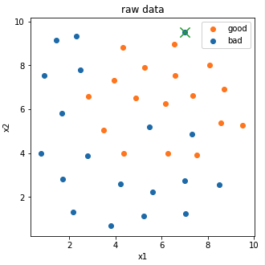
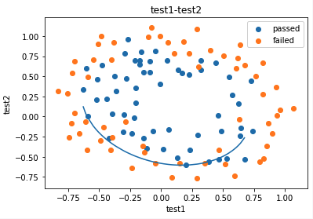
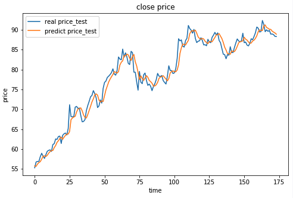
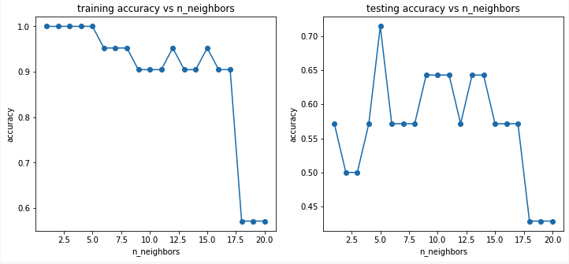
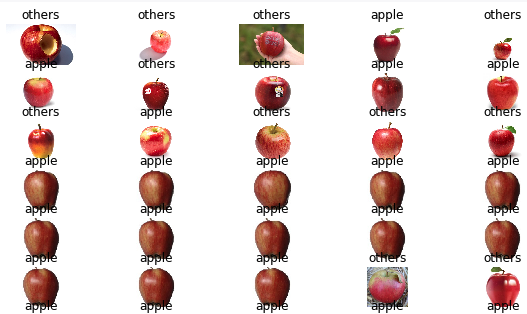

# 可视化常用方法

## x-y 
经典的**原始数据**展示方法(散点图、折线图均有涉及)



```python
# visualize the result
fig2 = plt.figure(figsize=(10,40))
for i in range(45):
    for j in range(5):
        img = load_img(img_path[i*5+j])#read the image
        plt.subplot(45,5,i*5+j+1)
        plt.title('apple' if y_predict_kmeans[i*5+j]==normal_apple_id else 'others')
        plt.imshow(img),plt.axis('off')
```
## x1-x2_boundary
边界函数模型评估图，常用于逻辑分析中。



```python
X1_new = X1.sort_values()
theta0 = LR2.intercept_
theta1,theta2,theta3,theta4,theta5 = LR2.coef_[0][0],LR2.coef_[0][1],LR2.coef_[0][2],LR2.coef_[0][3],LR2.coef_[0][4]
a = theta4
b = theta5*X1_new+theta2
c = theta0+theta1*X1_new+theta3*X1_new*X1_new
X2_new_boundary = (-b+np.sqrt(b*b-4*a*c))/(2*a)

fig2 = plt.figure()
passed=plt.scatter(data.loc[:,'test1'][mask],data.loc[:,'test2'][mask])
failed=plt.scatter(data.loc[:,'test1'][~mask],data.loc[:,'test2'][~mask])
plt.plot(X1_new,X2_new_boundary)
plt.title('test1-test2')
plt.xlabel('test1')
plt.ylabel('test2')
plt.legend((passed,failed),('passed','failed'))
plt.show()
```
## y-y_predict
结果比较，比较正确的y以及预测的y。


## epoch-score
过程中-模型评估，直观显示每次训练的效果。

```python
# try different k and calcualte the accuracy for each
n = [i for i in range(1,21)]
accuracy_train = []
accuracy_test = []
for i in n:
    knn = KNeighborsClassifier(n_neighbors=i)
    knn.fit(X_train,y_train)
    y_train_predict = knn.predict(X_train)
    y_test_predict = knn.predict(X_test)
    accuracy_train_i = accuracy_score(y_train,y_train_predict)
    accuracy_test_i = accuracy_score(y_test,y_test_predict)
    accuracy_train.append(accuracy_train_i)
    accuracy_test.append(accuracy_test_i)
print(accuracy_train,accuracy_test)


fig = plt.figure(figsize=(12,5))
plt.subplot(121)
plt.plot(n,accuracy_train,marker='o')
plt.title('training accuracy vs n_neighbors')
plt.xlabel('n_neighbors')
plt.ylabel('accuracy')
plt.subplot(122)
plt.plot(n,accuracy_test,marker='o')
plt.title('testing accuracy vs n_neighbors')
plt.xlabel('n_neighbors')
plt.ylabel('accuracy')

plt.show()
```

# data-label
用于图片分类问题。


```python
for i in range(45):
    for j in range(5):
        img = load_img(img_path[i*5+j])#read the image
        plt.subplot(45,5,i*5+j+1)
        plt.title('apple' if y_predict_ms[i*5+j]==normal_apple_id else 'others')
        plt.imshow(img),plt.axis('off')

```